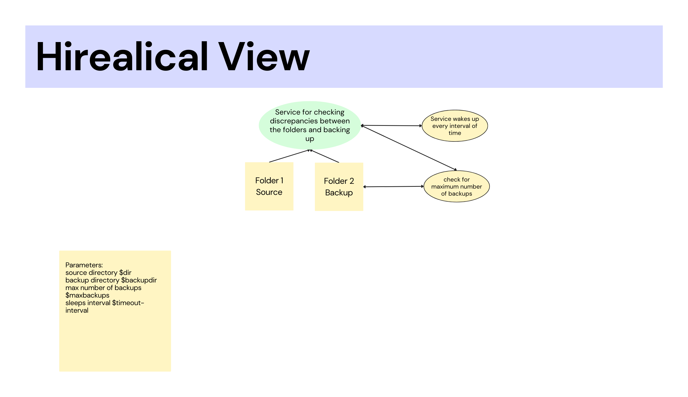

# Bash Script for backing up two directories :handshake:

A simple bash script to make a backup of a directory to another one while automatically checking if there is an update to the source directory and updating the backup directory.

## Environment Setup :gear:

### Script only :pen:
 * Place directories next to each other and the script next to them 
 * Run the script and append the inputs (dir , backupdir , maxbackups , intervalsecs) <Running in sudo mode will ensure process stability> 
 * Scripts executes sucessfully if there is no wrong input and the directory exists 
  

### Script with makefile :pencil:
* Place directories , script and make file in same folder
* Run "make" command in the shell 

 
### cronjob :arrows_clockwise:
 Place directories , script and make file in same folder 
 * 1st: user should place his "name" in the cron allow folder
  by doing "sudo cat cron.allow <their-name>" 
 * 2nd: user should run "sudo systemctl status cron.service"
to check if the cron service exists on his machine.
 * 3rd: if the user wants the script to run each minute he should open the crontab 
by doing "crontab -e" then putting the cronjob in it 
  <*/1 * * * * /bin/sh <pathtoscript>/scriptname.sh>
  scriptname would be backupd 

## Code overview :notebook_with_decorative_cover:

Code is divided into sections: 
* 1st : variable definition 
variables are defined then stored to be processed for validity 
 * 2nd : validtaion of variables 
 Validation is run to check for wrong formatted input 
*  3rd : backup service 
 A loop is run with a sleeping period to check for the maximum number of backups and process the backup 

## Hierarchical view :mount_fuji:

 

  
### Licensing :pencil:

This code is licensed under the MIT License.

### Authors :pen:

* Marwan Radwan

### Contribution :clinking_glasses:

Feel free to contribute just make a pull request and do what you wish. 😼

